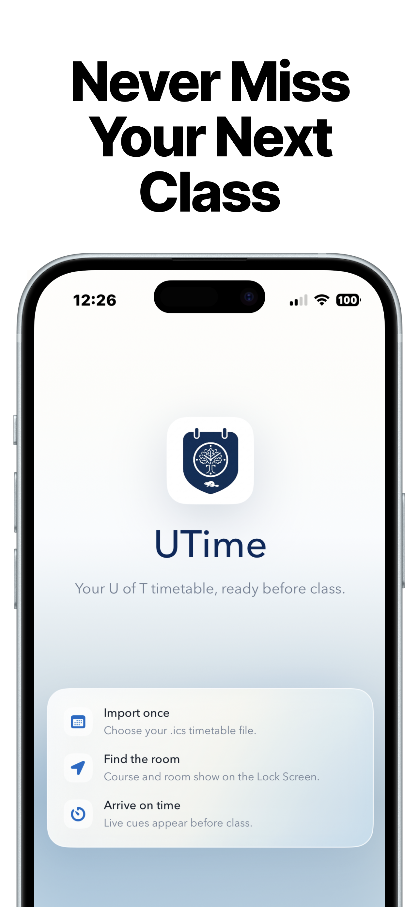

<p align="center">
  
</p>

<h1 align="center">UTime</h1>

<p align="center">
  Your U of T timetable, ready before class.
</p>

<p align="center">
  
  
  
  
</p>

<p align="center">
  UTime is a clean iOS timetable companion for University of Toronto students. Import your `.ics` schedule once, then see your next class, room, and timing where it matters most: in the app, on the Lock Screen, and in the Dynamic Island.
</p>

<p align="center">
  
  
  
</p>

## Why UTime

UTime turns a static university calendar export into a live class companion:

- Import a U of T `.ics` timetable and expand recurring weekly classes.
- See the next class with course code, section, delivery mode, room, and start time.
- Show class updates through Lock Screen Live Activities.
- Keep the Dynamic Island focused on the class and room you need next.
- Tune reminder timing and red-alert cues before class.
- Replace or clear an imported schedule whenever your timetable changes.

## iOS Experience

<p align="center">
  
  
</p>

UTime is built around native iPhone surfaces instead of another calendar view to check:

- **In-app schedule** for upcoming classes and timetable import.
- **Lock Screen updates** for class countdown, start time, and room.
- **Dynamic Island glance** for compact course and room context.
- **Local schedule storage** with SwiftData.
- **Live Activity sync plumbing** for remote update support.

## Calendar Import

The importer supports the calendar details U of T timetables commonly rely on:

- `DTSTART` / `DTEND`
- weekly `RRULE` expansion
- `COUNT`, `UNTIL`, `INTERVAL`, and `BYDAY`
- `EXDATE` skipped classes
- `RDATE` extra or makeup classes
- async, online, and in-person metadata detection

## Tech Stack

- Swift
- SwiftUI
- SwiftData
- ActivityKit / WidgetKit
- Supabase Edge Functions for backend Live Activity support
- iOS 17.6+

## Project Layout

```text
UofTimetable/          Main iOS app
UofTimetableWidget/    Live Activity and widget extension
UofTimetableShared/    Shared ActivityKit attributes
supabase/              Edge functions and migrations
privacy/               Privacy policy page
```

## Run Locally

1. Open `UofTimetable.xcodeproj` in Xcode.
2. Select the `UofTimetable` scheme.
3. Choose an iPhone simulator or connected iPhone.
4. Build and run.

For Live Activities, use a device or simulator/runtime that supports ActivityKit.

## Import A Timetable

1. Export your timetable as an `.ics` calendar file.
2. Open UTime and choose **Import .ics File**.
3. Set how early Live Activities should appear.
4. Let UTime surface the next class before it starts.

## Notes

UTime is designed for University of Toronto timetable exports. Other `.ics` calendars may import successfully, but the course, section, room, and delivery-mode parsing is tuned for U of T class data.
