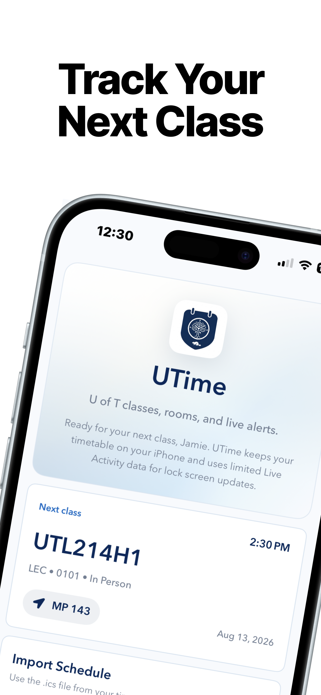
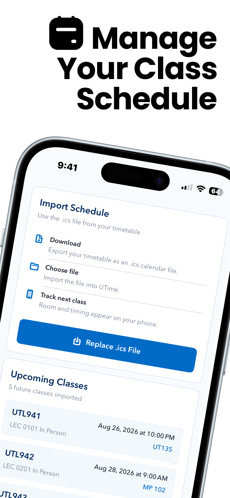
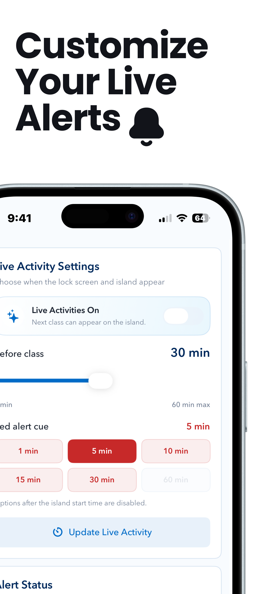
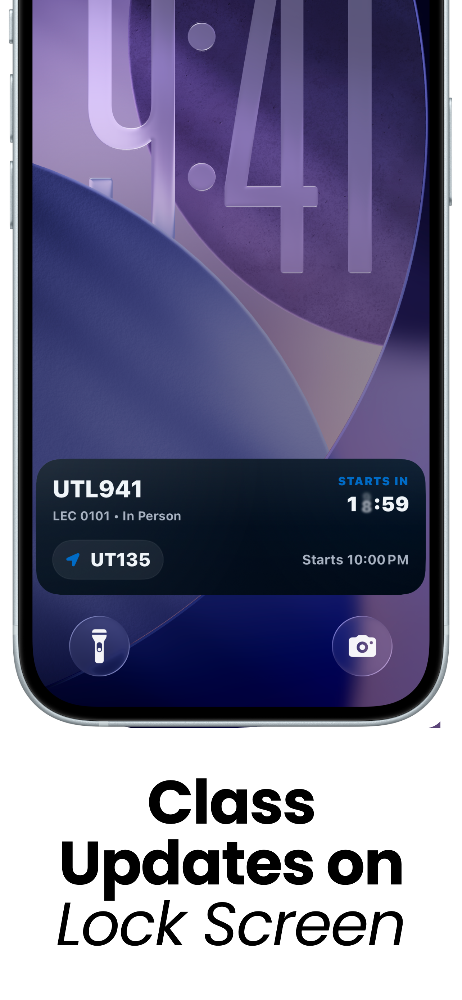
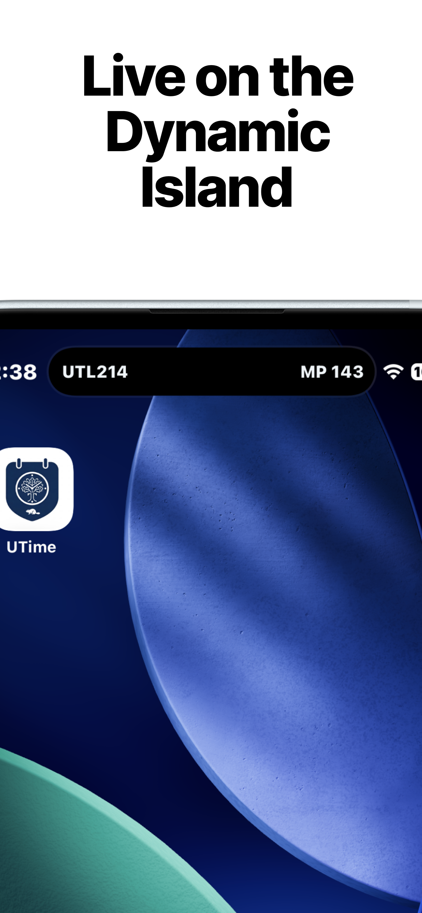

<p align="center">
  
</p>

<h1 align="center">UTime</h1>

<p align="center">
  A clean iOS timetable companion for University of Toronto students.
</p>

<p align="center">
  
  
  
  
</p>

<p align="center">
  Upload your ACORN timetable image or enter your courses manually, then use <strong>Today</strong>, <strong>Schedule</strong>, <strong>Alerts</strong>, and <strong>Profile</strong> to keep your next class, room, delivery mode, and Live Activity timing close at hand.
</p>

<p align="center">
  
  
  
</p>

## Overview

UTime turns a weekly U of T timetable into a practical class companion for iPhone. Instead of checking a full calendar every time you need a room, UTime focuses on the question students usually care about most:

**What is my next class, when does it start, and where do I need to go?**

The app is organized around a bottom navigation bar with four focused sections:

- **Today** shows the next class, the room, and a compact overview of the day.
- **Schedule** handles PNG import, manual course entry, clearing, and upcoming class management.
- **Alerts** controls when Live Activities appear and when urgent cues should start.
- **Profile** keeps local student context and app actions in one quiet place.

## v2.2 Highlights

Version `2.2` improves timetable image recognition and makes the upload flow easier to complete.

- **Better screenshot recognition:** Rescans the course table separately from Safari controls and retries missing day labels in a focused crop.
- **Multiple meetings per course:** Preserves separate lectures and tutorials, including rows that list more than one day. Missing days can be recovered from an unambiguous grid match after checking the other meetings for that course.
- **Improved time interpretation:** Uses the grid’s chronological hour sequence to distinguish morning and afternoon times. Ambiguous AM/PM still requires review.
- **Editable scan results:** Keeps unreadable fields in the draft with clear correction prompts instead of rejecting the whole timetable. Lecture section numbers are optional.
- **Simpler upload:** One confirmation covers the reviewed scan. **Upload timetable** saves directly, while **Preview class dates (optional)** lets you remove holidays first. Missing required details show an explanation when you tap Upload.
- **Easier-to-tap buttons:** **Upload timetable** and **Add a course** respond across their full visible button area, including the sides, without making the surrounding card tappable.

PNG import and manual entry remain available. New classes are added alongside existing schedules; ICS import remains removed.

## Screenshots

The images below and above show earlier app screens; the v2.2 timetable-entry screens are not pictured yet.

<p align="center">
  
  
</p>

UTime is designed around native iPhone surfaces instead of becoming another heavy calendar screen. The app keeps the main interface calm, then uses Lock Screen and Dynamic Island surfaces when timing matters.

## Core Features

### Today

The **Today** section is the main landing view. It highlights the next class with the course code, section details, start time, date, and room when one is available. Below that, the overview panel keeps the day readable with counts for classes today, upcoming classes, alert timing, and Dynamic Island status.

### Schedule

The **Schedule** section lets you add courses manually, with term dates and weekly lecture, tutorial, lab, or seminar meetings. Review generated class dates and swipe to exclude holidays before saving. New courses are appended to the existing schedule. Use **Upload timetable** to scan an ACORN PNG from Files or Photos. Recognition runs on-device, and all extracted courses can be edited before saving.

### Alerts

The **Alerts** section controls how early UTime starts Live Activity updates before class. It also lets users choose a red-alert cue, so the app can become more noticeable as the start time gets closer.

### Profile

The **Profile** section stores local student details such as campus, program, year, and scheduled class count. It also includes a small **Rate UTime** row for users who want to leave an App Store review, without turning the page into a promotion screen.

## Live Activities

UTime uses native iOS Live Activities to keep the next class visible when it matters most:

- **Lock Screen** updates show the course, room or delivery mode, countdown, and start time.
- **Dynamic Island** keeps the compact view focused on the course and room.
- **Alert timing** can be adjusted so updates appear before class instead of at the last second.
- **Red-alert cues** help make the final minutes before class easier to notice.

The goal is not to mirror the whole schedule on the Lock Screen. UTime only surfaces the immediate next class, which keeps the experience focused and glanceable.

## Timetable Entry

Manual entry uses Toronto time and expands weekly meetings across the selected term, preserving local class times across daylight-saving changes. Set in-person locations or mark a meeting as online. Review class dates before saving; holidays and reading week are not excluded automatically. Saved occurrences can be deleted individually from Schedule.

ICS import has been removed. Existing saved schedules remain available. PNG import reads the full Course / Day / Time / Location table beneath the grid. Grid-only screenshots are not supported. The review includes the original image and requires confirmation of meetings and exact term dates. The importer rescans the table separately from browser controls and matches course labels to the grid’s chronological hour sequence. Unmarked AM/PM still requires confirmation. Missing or unreadable fields stay in the editable draft with review flags instead of rejecting the entire schedule; unresolved times show explicitly labeled placeholders. One “I checked all meetings and term dates” confirmation covers the reviewed scan; missing days, course codes, and invalid times must still be corrected. Lecture section numbers are optional. The image does not provide holidays or the winter schedule of a year-long course.

## Privacy and Data

UTime is built around local timetable use:

- Student profile details stay on device.
- Timetable image recognition runs on-device; the image is not uploaded for OCR.
- Imported class data is used to power the app’s schedule and Live Activity views.
- No account is required to import or view a timetable.
- Live Activity support uses only the data needed to show class updates.

Read the full privacy policy at [jamieryu.com/UTime/privacy](https://jamieryu.com/UTime/privacy/index.html).

## Tech Stack

- Swift
- SwiftUI
- SwiftData
- Vision / PhotosUI for timetable image import
- ActivityKit / WidgetKit
- Supabase Edge Functions for backend Live Activity support
- iOS 17.6+

## Project Layout

```text
UofTimetable/          Main iOS app
UofTimetableWidget/    Live Activity and widget extension
UofTimetableShared/    Shared ActivityKit attributes
supabase/              Edge functions and migrations
privacy/               Privacy policy page
```

## Run Locally

1. Open `UofTimetable.xcodeproj` in Xcode.
2. Select the `UofTimetable` scheme.
3. Choose an iPhone simulator or connected iPhone.
4. Build and run.

For Live Activities, use a device or simulator/runtime that supports ActivityKit.

## Add a Timetable in the App

### Upload an ACORN PNG

1. Open **Schedule** and tap **Upload timetable**.
2. Choose **Choose from Photos** or **Choose PNG from Files**. Include the entire grid with hour labels and the full Course / Day / Time / Location table; Safari bars are okay. Images must be 20 MB or smaller.
3. After recognition finishes, tap **Review & import** at the bottom.
4. Compare the extracted courses with the original PNG, correct any details, and set the exact term dates. Correct any flagged meeting details, including AM/PM, before confirming the scan.
5. Turn on **I checked all meetings and term dates**, then tap **Upload timetable** to save.
6. To exclude holidays, reading week, or cancelled classes first, open **Preview class dates (optional)**, swipe left on dates, and tap **Upload timetable**.

### Enter courses manually

1. Open **Schedule** and tap **Add a course**.
2. Enter the course, term dates, and weekly meetings. Use **Add another meeting** for additional days, tutorials, or labs.
3. Tap **Save course**, or open **Preview class dates (optional)** to remove excluded dates before saving.
4. Repeat for the next course; term dates are remembered.

Open **Alerts** to set Live Activity timing after saving your timetable.

## Checks

```sh
swiftc UofTimetable/CourseReminderSnapshot.swift UofTimetable/ManualCourse.swift tests/ManualCourseChecks.swift -o /tmp/manual-course-checks
/tmp/manual-course-checks
swiftc UofTimetable/CourseReminderSnapshot.swift UofTimetable/ManualCourse.swift UofTimetable/TimetableImageParser.swift tests/TimetableImageChecks.swift -o /tmp/timetable-image-checks
/tmp/timetable-image-checks
```

The image checks also accept the original sample PNG path as an argument to validate actual Vision output against the expected four courses and nine weekly meetings.

## Notes

The App Store review action opens UTime’s App Store review page directly, which makes the Profile review row reliable when someone chooses to use it.

## Copyright

Copyright (c) 2026 Jamie Ryu. All rights reserved.
